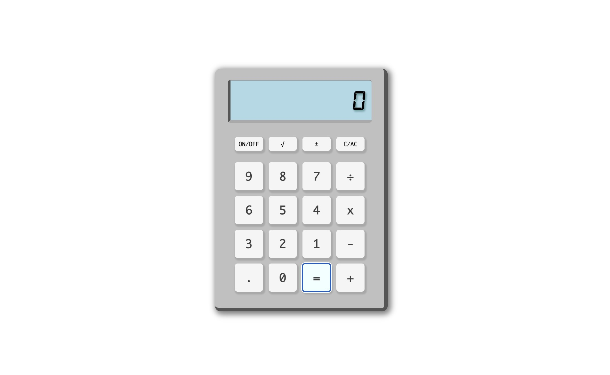

# 🧮 JavaScript Calculator

A simple, browser-based calculator built with **HTML**, **CSS**, and **JavaScript**.  
It supports basic arithmetic operations, square roots, sign toggling, and scientific notation for large numbers.

---

## 🚀 Features

- **Basic Operations**: Addition, subtraction, multiplication, and division.  
- **Clear/All Clear (`C/AC`)**  
- **Scientific Notation** for numbers longer than 6 digits.  
- Displays `"infinity"` for numbers too large to fit the display.  
- Prevents division by zero with an alert message.

---

## 📂 Project Structure

```
calculator/
│── index.html    # Main HTML layout
│── styles.css    # Calculator styling
│── scripts.js    # Core JavaScript logic
```

---

## ⚙️ How It Works

1. **User Interface (HTML + CSS)**  
   - Buttons for digits (0–9), operations (+, -, ×, ÷), and special functions (√, ±, C/AC).  
   - Display area (`.screen`) shows the current input or result.

2. **Logic (JavaScript)**  
   - **appendNumber(number)**: Adds digits to the current input (limits to 6 digits before switching to scientific notation).  
   - **appendOperation(op)**: Stores the operation and prepares for the second number.  
   - **calculate()**: Performs the stored operation between two numbers.  
   - **clearDisplay()**: Resets all values.  
   - Handles **scientific notation** and displays `"infinity"` for overly large results.

---

## 🖥️ Installation & Usage

1. **Download or Clone** the repository:
   ```bash
   git clone https://github.com/daanniill/calculator.git
   ```

2. **Open `index.html`** in your preferred browser.

3. Start calculating! 🎉

---

## Sample Preview


---

## 📝 Example Behavior

- Input: `9999999 + 1` → Display: `1.00e+7`  
- Input: Very large number beyond display limit → Display: `"infinity"`  
- Input: `5 ÷ 0` → Alert: `"Cannot divide by zero"`

---

## 📌 Future Improvements

- Add **keyboard support** for faster input.  
- Add **memory functions** (M+, M-, MR).  
- Improve **mobile responsiveness**.  
- Dark mode toggle 🌙.

---

## 📜 License

This project is open source and available under the [MIT License](LICENSE).
